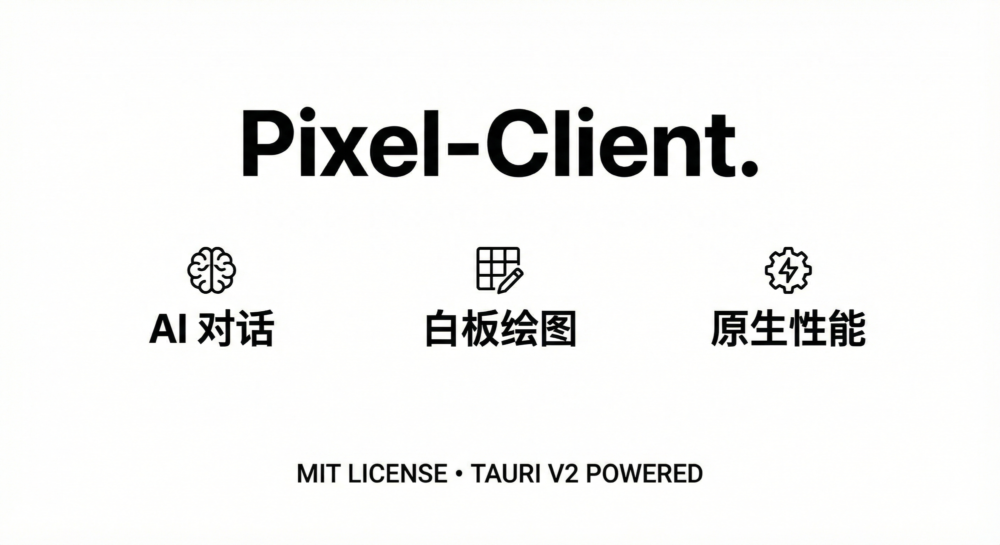

<div align="center">
  
</div>

# Pixel-Client

> 基于 Tauri v2 + React 的 AI 聊天应用客户端

[English](README_EN.md) | 简体中文

## 简介

Pixel-Client 是一个功能强大的 AI 聊天桌面应用，采用 Tauri v2 和 React 构建，支持多模型对话、白板绘图、Markdown 渲染等功能。

## 功能特性

| 功能 | 描述 |
|------|------|
| AI 对话 | 支持多模型流式对话，集成多种 LLM 提供商 |
| Excalidraw 白板 | 内置绘图工具，支持场景保存与导出 |
| Markdown 渲染 | 语法高亮、自定义标签支持 |
| 状态持久化 | 自动保存聊天记录和场景数据 |
| MCP 协议 | 支持 Model Context Protocol 服务器管理 |
| AI 技能系统 | 可执行 JavaScript 技能脚本 |
| Deep Thinking | 深度思考模式，支持分层推理 |
| 多主题 | 10 种主题自由切换 |
| 多语言 | 支持中文、英文、日文 |
| 状态备份 | 自动备份和导入导出功能 |

## 与原版 Pixel-Client 对比

| 指标 | 原版 (Web) | Tauri 版 |
|------|-----------|----------|
| API 端点数 | 32 | 66 (+106%) |
| 新增功能 | - | 10 项 |
| 移植完成度 | - | 100% |
| 安全模型 | API Key 网络传输 | 本地存储，无网络传输 |
| 离线能力 | 依赖远程服务器 | 完全离线运行 |

## 技术栈

- **前端**: React 19 + TypeScript + Vite
- **UI**: Tailwind CSS + Lucide Icons
- **后端**: Tauri v2 + Rust
- **包管理**: Bun 1.2.23
- **测试**: Vitest 4.0.17

## 快速开始

### 前置条件

- [Bun](https://bun.sh) >= 1.0
- [Node.js](https://nodejs.org) >= 18
- [Rust](https://rustup.rs) >= 1.70 (用于 Tauri 构建)

### 安装依赖

```bash
bun install
```

### 环境配置

1. 复制环境变量模板：

```bash
cp .env.example .env.local
```

2. 在 `.env.local` 中配置 API 密钥：

```env
# Gemini API Key
GEMINI_API_KEY=your_gemini_api_key_here
```

### 运行开发版本

```bash
bun run dev
```

### 构建生产版本

```bash
# 构建前端
bun run build

# 构建 Tauri 应用 (默认当前平台)
bun run tauri build
```

### 跨平台构建

#### Windows (在 Windows 上构建)

```bash
bun run tauri build
```

#### Linux (使用 Docker 构建)

```bash
# 拉取 Tauri 构建镜像
docker pull ghcr.io/tauri-apps/tauri-builder:2

# 运行 Linux 构建
docker run --rm \
  -v "$PWD":/app \
  -v "$PWD/src-tauri/target":/app/src-tauri/target \
  -e TAURI_PRIVATE_KEY_PASSWORD \
  -e TAURI_PRIVATE_KEY \
  ghcr.io/tauri-apps/tauri-builder:2 \
  bun install && bun run build && bun run tauri build
```

**注意**: 需要设置环境变量 `TAURI_PRIVATE_KEY` (私钥) 和 `TAURI_PRIVATE_KEY_PASSWORD` (私钥密码) 来签名应用。

#### macOS (需要 Xcode 和 Rust)

```bash
# 安装 Rust 目标
rustup target add aarch64-apple-darwin x86_64-apple-darwin

# 构建 Apple Silicon 版本
bun run tauri build --target aarch64-apple-darwin

# 构建 Intel 版本
bun run tauri build --target x86_64-apple-darwin
```

**注意**: macOS 构建需要在 macOS 系统上进行，或使用 macOS CI 服务。

## 项目结构

```
pixel-client-tauri/
├── src/                    # 前端源代码
│   ├── components/         # React 组件
│   │   ├── Chat/           # 聊天组件
│   │   └── ModelManager/   # 模型管理组件
│   ├── hooks/              # 自定义 Hooks
│   ├── services/           # API 服务
│   ├── types/              # TypeScript 类型
│   └── __tests__/          # 测试文件
├── src-tauri/              # Tauri 后端
│   ├── src/
│   │   ├── commands/       # Tauri 命令
│   │   ├── services/       # 后端服务
│   │   └── state.rs        # 状态管理
│   └── Cargo.toml          # Rust 依赖
├── docs/                   # 文档
│   ├── API.md              # API 文档
│   └── ARCHITECTURE.md     # 架构文档
├── planning/               # 规划文件
└── README.md               # 本文档
```

## 可用命令

| 命令 | 描述 |
|------|------|
| `bun run dev` | 启动开发服务器 |
| `bun run build` | 构建前端 |
| `bun run tauri dev` | 启动 Tauri 开发窗口 |
| `bun run tauri build` | 构建 Tauri 安装包 |
| `bun test` | 运行测试 |
| `bun run lint` | 代码检查 |
| `bun run format` | 代码格式化 |

## API 文档

详细的命令 API 文档请参阅 [docs/API.md](docs/API.md)。

## 架构文档

系统架构说明请参阅 [docs/ARCHITECTURE.md](docs/ARCHITECTURE.md)。

## 测试

```bash
# 运行所有测试
bun test

# 运行并观看
bun test --watch
```

## 许可证

本项目基于 MIT 许可证开源。

## 贡献

欢迎提交 Issue 和 Pull Request！

---

<div align="center">
  Made with Tauri + React
</div>
